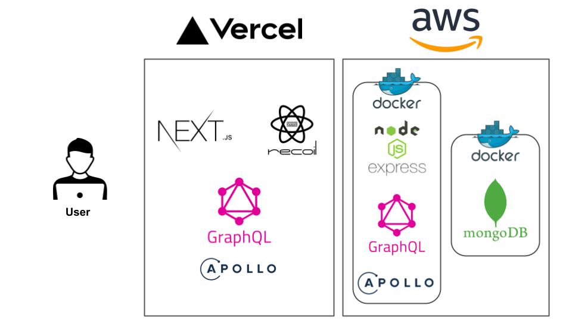

## 🗓 SpareTime?

SpareTime 프로젝트는 달력에 여러 정보들을 복합적으로 넣은 스케쥴러입니다.<br/>
주요 기획 의도는 원하는 기능들이 하나의 스케쥴러에 모두 들어가 한번에 확인하고 관리할 수 있는 서비스입니다.<br/>
기존의 나눠져 있던 스케쥴러 서비스에 대한 불편점을 개선하고 보완한 새로운 서비스를 제공하고자 하였습니다.<br/><br/>
스케쥴러에 포함된 정보는 다음과 같습니다.<br/>

- 일정
- 일기
- <del>투두리스트</del>
- <del>30일 챌린지</del>
- <del>회고록</del>
- <del>집중시간 / 낭비시간</del>
- <del>차트</del>

❗ <strong>현재는 일정과 일기만 구현되어있습니다.</strong>

홈페이지 주소 : https://spare-time.vercel.app/calendar

API 서버 : https://15.165.162.58:4000/graphql

### 현재 apollo-client가 apollo-server https 인증서 오류로 연결이 되지 않는 오류가 있습니다.

### 테스트를 위해 api 서버를 먼저 실행후 실제 서비스를 접속해주시면 감사하겠습니다

## 🧑‍💻 Stack

### Front

- next
- styled-components
- material-ui
- fullcalendar
- dayjs
- axios
- recoil
- apollo-client

### Back

- express
- mongodb + mongoose
- dayjs
- axios
- graphql
- apollo-server-express

### Deploy

- Docker
- Aws EC2
- Vercel

## 📁 Schema

```typescript jsx
export interface IDate extends Document {
  date: string
  diaries?: IDiary[]
  schedules?: ISchedule[]
}

interface IDiary {
  title: string
  content: string
  createdAt: string
  updatedAt: string
}

interface ISchedule {
  title: string
  location?: string
  start: string
  end: string
  createdAt: string
  updatedAt: string
}
```

유저가 선택한 날짜가 date로 가본키값으로 사용하며, 데이터가 수정될경우 diaries, schedules 배열에 추가 삭제하는식으로 구현되어있습니다.

해당 스키마의 경우 필드 하나만 바꾸는데 데이터가 많을경우 엄청나게 많은 데이터를 불러들이는 문제가 발생할 수가 있습니다.

만약 어떤 ISchedule의 title 수정을 요청받았을 때 그 데이트의 schedule이 만개면 만개 딥카피 떠서 타이틀만 바꾸고 바꿔치기 해야되지만,
몽고디비는 ACID 안지키고 도큐먼트 단위 원자성만 지원해서 그사이에 누가 또 수정하면 데이터 이상해질 수도 있습니다. 그래서 디비락걸고 수행하는데 만개짜리 딥카피때문에 디비 자체가 느려지게 됩니다.

그렇기 때문에, 보통 만개정도 이상으로 많은 경우에는 따로 배열을 분리하고 키값으로 연관 키값을 넣어서 구현합니다.
먼저 date를 읽고 schedule 도큐먼트에 그룹이랑 aggregation을 그 date 키값으로 걸어서 읽어오는 식으로 하게됩니다.
하지만 이 방식의 단점은 도튜먼트가 연관 키값으로 묶이긴 하는데 따로존재해서 만약 데이트를 삭제했을 때 그 데이트 키값을 가지는 schedule, diaries도 삭제할 때
트랜젝션 걸고 해야하지만 몽고디비는 그런걸 지원 안해서 아토믹하게 짤려면 개발자가 직접 책임지고 짜야합니다.

하지만 해당 프로젝트의 경우 데이터가 많지 않기 때문에, 안전하게 하나의 도큐먼트에서 전부 관리하는식으로 구현했습니다.

## 📋 Design

### 전체 시스템 구조


*version1*

### aws와 vercel을 둘다 사용하는 이유

vercel의 경우 Next JS를 개발한 회사이기 때문에 프로젝트 배포에 가장 최적화된 플랫폼으로
HTTPS와 CDN이 적용된 상태로 배포되며, CI/CD 자동화에 대한 환경을 고려하지 않아도 됩니다.

SpareTime의 경우 개인 프로젝트로 만든 서비스이기 때문에 트래픽도 적기때문에, 이미 잘 만들어진 무료 호스팅서비스인 vercel을 사용했습니다.

하지만 vercel 하나로 API 서버와 디비 그리고 클라이언트 서버까지 한번에 돌리기에는 무리가 있고 사용량에 따라서 제한이 있기 때문에 추가적으로 AWS EC2의 인스턴스를 생성하여
DB와 API 서버로 사용하였습니다.

## ✅ 프로젝트를 진행하면서 기록으로 남기고 싶은 에러들

### 1. m1에서 이미지 빌드시 aws linux환경에서 빌드가 되지 않는 문제

- --platform 옵션을 줘서 해결

> docker build --platform linux/amd64 -t [image-name] .

### 2. graphQL의 캐싱 기능 때문에 데이터 추가후 조회가 제대로 되지 않았던 문제

- 조회 쿼리에 fetch policy 옵션 추가

```javascript
const [getDateRange] = useLazyQuery(GET_DATE_RANGE, {
  fetchPolicy: 'network-only',
})
```

### 3. AWS에서 서버 실행시 타임존이 달라서 디비에 시간이 제대로 들어가지 않는 문제

- aws timezone 수정후 재부팅

> sudo rm /etc/localtime
>
> sudo ln -s /usr/share/zoneinfo/Asia/Seoul /etc/localtime

### 4. mongoDB 컨테이너가 내려갔을 경우에 기존 디비데이터를 복구하는 방법

- docker를 실행할 때 -v옵션 사용하여 볼륨을 설정
- -v {외부Volume}:/data/db

> docker run -p 27017:27017 -v /home/ubuntu/mongodb/data:/data/db -d spare-time-mongo:0.0.1

### 5. apollo client가 https 인증서 오류가 날경우 제대로 연결되지 않는 오류

- apollo-server API서버를 먼저 들어가지 않고 실제 페이지를 들어갔을 경우 에러가 나서 모든 동작이 재대로 일어나지 않음
- 해결중..

## 🌐 SEO

추가 예정